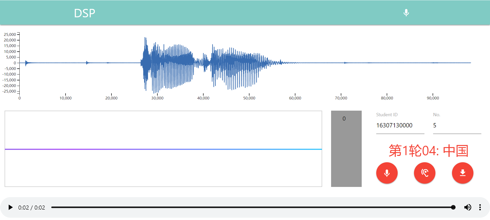

# audio-collector

Audio collecting website for building a speech dataset for Digital Signal Processing course project

## Words

Record the following 20 words from label `00` to `19` for 20 times.

|  00    |   01  |    02  |   03  |    04    |    05 |   06   |  07   |    08  |    09    |
| ------ | ------ | ------ | ------- | ------- |------ | ------ | ------ | ------- | ------- |
| 数字    | 语音   | 语言   | 识别     | 中国    | 总工    | 北京   | 背景   | 上海     | 商行    |

|  10    |   11  |    12  |   13  |    14    |    15 |   16   |  17   |    18  |    19    |
| ------ | ------ | ------ | ------- | ------- |------ | ------ | ------ | ------- | ------- |
| 复旦    | 饭店   | Speech | Speaker | Signal  |Process | Print | Open   | Close   | Project |

## Parameters

| Format | AudioFormat | NumChannels  | SampleRate | BitRate | BitDepth |length |
| ------ | ------ | ------ | ------- | ------- | ------- | ------- |
| `.wav` | PCM | 1 | 16 kHz | 256 kbps | 16 bits | ~2 s |

These are the important parameters regarding the audio files. 
If you'd like to get more information about the audio files, 
you can look closely at the header of the files.
While doing so, keep in mind that it's __little-endian__ format!

## Website

https://czhongyu.github.io/audio-collector/

* __wave curve__ shows the wave pattern of your last recording
* __Bezier curve__ visually shows the volume of what the mic captures
* __volume bar__ shows the volume with its value (0 ~ 100) and a green bar
* __Student ID input field__ input your ID here
* __No. input field__ input a `number` (1 ~ 400) here
* __round__ (1 ~ 20) `round = number / 20 + 1`
* __label__ (00 ~ 19) `label = number % 20`
* __prompt word__ will change as the label changes
* __mic button__ starts recording
* __ear button__ plays back the recording
* __download button__ downloads the recording

## Browser Compatibility

* It works on __Google Chrome__ and __360 Secure Browser__.
* It does NOT work on __Safari__, __Microsoft Edge__ and __Internet Explorer__!

## Usage

* Visit the above website and enter the recording page
* Input your student ID and the `number`
* Click __mic button__ to start recording and say the prompt word clearly in 2 seconds
* Click __ear button__ to confirm your recording
* Click __download button__ to download your recording 
* Repeat the above process as the `number` changes from 1 to 400 
* Put the 20 x 20 correctly named recordings in a folder named after your student ID

## Attention

* It works best with full screen as the charts are not adaptive!
* If the browser is not compatible, you will be alerted and please use another browser!
* If access to your mic is blocked, the start button will remain disabled and you will also be alerted!
* If you click __download button__ with no ID input, download will fail and you will also be alerted!
* Remember to enable the mic as well!

## Author

Zhongyu Chen
